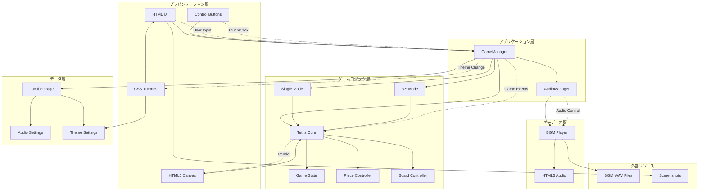
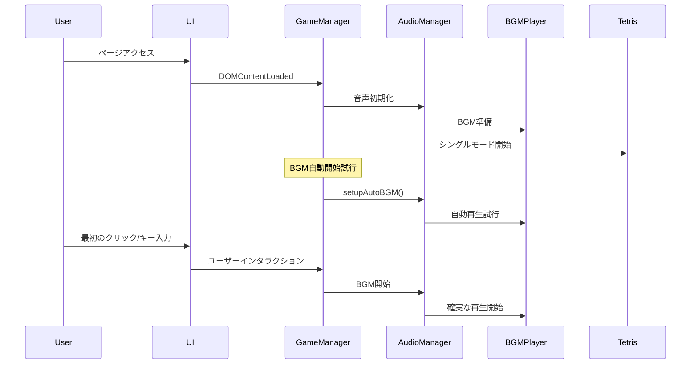
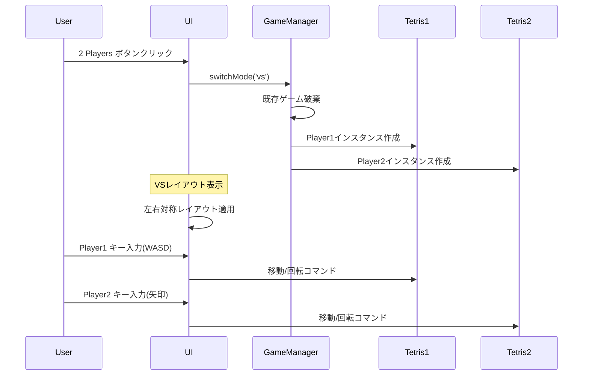
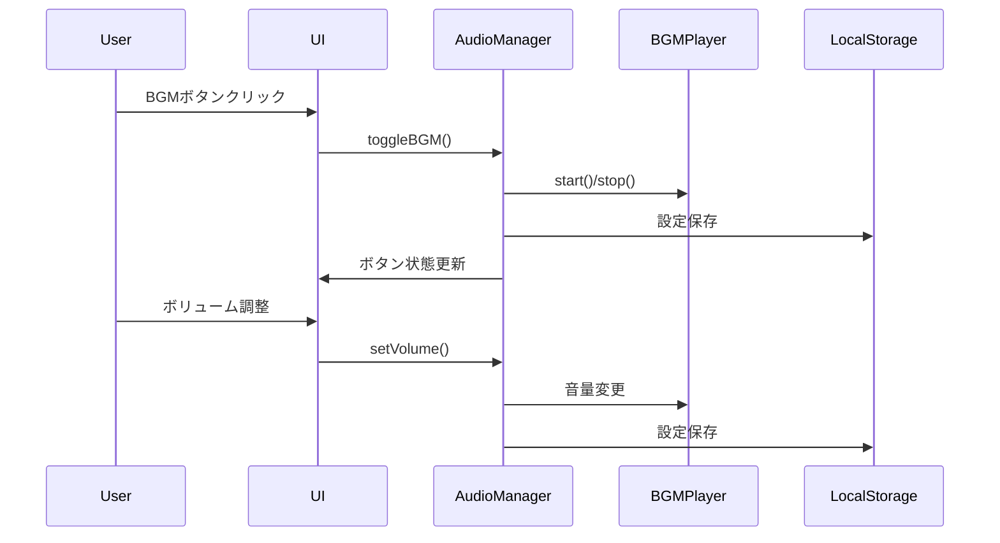

# Kiro-Tetris 論理アーキテクチャ

## 概要

Kiro-Tetrisは、HTML5、CSS3、JavaScriptを使用したWebベースのテトリスゲームです。シングルプレイヤーモードと2プレイヤー対戦モードをサポートし、BGM再生機能とテーマ切り替え機能を備えています。

## 論理アーキテクチャ図

## コンポーネント詳細

### プレゼンテーション層

#### HTML UI
- **責任**: ユーザーインターフェースの構造定義
- **機能**: 
  - 1プレイヤー・2プレイヤーモードレイアウト
  - 左右対称VSモードデザイン
  - スコア・レベル・ライン数表示
  - モード選択インターフェース
  - レスポンシブデザイン対応

#### CSS Themes
- **責任**: 視覚的スタイリングとテーマ管理
- **機能**:
  - ダークテーマ（デフォルト）
  - ライトテーマ
  - ギャルテーマ（グロー効果付き）
  - VSモード専用スタイリング
  - モバイル・タブレット対応

#### HTML5 Canvas
- **責任**: ゲーム画面の描画
- **機能**:
  - テトリスボード描画（1P: 400x800px, 2P: 350x700px）
  - テトリミノ描画とアニメーション
  - Next piece プレビュー
  - テーマ別カラーリング

#### Control Buttons
- **責任**: タッチ・クリック操作インターフェース
- **機能**:
  - 1プレイヤーモード用操作ボタン
  - 2プレイヤーモード専用ボタン（各プレイヤー別）
  - VSモード制御ボタン（Pause/Restart）
  - レスポンシブボタンレイアウト

### アプリケーション層

#### GameManager
- **責任**: アプリケーション全体の制御
- **機能**:
  - シングル・VSモード切り替え
  - 複数ゲームインスタンス管理
  - テーマ切り替え制御
  - BGM自動開始制御
  - ユーザーインタラクション検出

#### AudioManager
- **責任**: 音声機能の統合管理
- **機能**:
  - BGM ON/OFF制御
  - ボリューム調整（0-100%）
  - ポーズ時BGM制御
  - LocalStorage設定永続化
  - ユーザーインタラクション対応

### ゲームロジック層

#### Tetris Core
- **責任**: メインゲームロジック
- **機能**:
  - 60FPS ゲームループ
  - 衝突判定システム
  - ライン消去アルゴリズム
  - スコア・レベル計算
  - テーマ別描画制御

#### Game State
- **責任**: ゲーム状態管理
- **機能**:
  - スコア、レベル、ライン数追跡
  - ゲームオーバー・ポーズ状態
  - プレイヤー別状態管理（VSモード）
  - 勝者判定（VSモード）

#### Piece Controller
- **責任**: テトリミノ制御
- **機能**:
  - 7種類テトリミノ生成（I,O,T,S,Z,J,L）
  - 移動・回転・ドロップ制御
  - Next piece プレビュー
  - キーボード・タッチ入力処理

#### Board Controller
- **責任**: ゲームボード管理
- **機能**:
  - 10x20 ボード状態管理
  - ライン完成判定
  - ブロック配置・消去
  - 描画データ生成

#### Single Mode
- **責任**: 1プレイヤーモード制御
- **機能**:
  - 単一ゲームインスタンス管理
  - ハイスコア記録
  - ポーズ・リスタート機能

#### VS Mode
- **責任**: 2プレイヤー対戦モード制御
- **機能**:
  - 2つの独立ゲームインスタンス
  - 同期ポーズ・リスタート
  - 勝敗判定システム
  - プレイヤー別操作分離

### オーディオ層

#### BGM Player
- **責任**: BGM再生制御
- **機能**:
  - WAVファイル再生・ループ
  - 音量調整（0-100%）
  - 再生・停止・ポーズ制御
  - 自動再生フォールバック
  - エラーハンドリング

#### HTML5 Audio
- **責任**: ブラウザ音声API
- **機能**:
  - Audio要素による音声再生
  - ユーザーインタラクション対応
  - Autoplay Policy準拠
  - クロスブラウザ互換性

### データ層

#### Local Storage
- **責任**: ブラウザローカルストレージ
- **機能**:
  - JSON形式設定保存
  - 自動読み込み・復元
  - 設定変更時の即座保存

#### Audio Settings
- **責任**: 音声設定管理
- **機能**:
  - BGM有効/無効状態
  - ボリューム値（0.0-1.0）
  - デフォルト設定管理

#### Theme Settings
- **責任**: テーマ設定管理
- **機能**:
  - 選択中テーマ保存
  - テーマ別設定値
  - CSS適用状態管理

## データフロー

### ゲーム初期化フロー

### VSモード切り替えフロー

### BGM制御フロー

## 技術スタック

- **フロントエンド**: HTML5, CSS3, JavaScript (ES6+)
- **グラフィックス**: HTML5 Canvas API (2D Context)
- **オーディオ**: HTML5 Audio API, WAV形式対応
- **ストレージ**: Local Storage API (JSON形式)
- **アーキテクチャパターン**: 階層化アーキテクチャ + MVC
- **レスポンシブ**: CSS Media Queries, Flexbox, Grid
- **アニメーション**: requestAnimationFrame, CSS Transitions

## 設計原則

1. **単一責任原則**: 各クラスは単一の責任を持つ
2. **疎結合**: コンポーネント間の依存関係を最小化
3. **再利用性**: 共通機能の再利用可能な設計
4. **拡張性**: 新機能追加が容易な構造
5. **保守性**: 理解しやすく修正しやすいコード

## パフォーマンス考慮事項

- **requestAnimationFrame**: 60FPS スムーズなゲームループ
- **イベント委譲**: 効率的なイベント処理とメモリ使用量削減
- **メモリ管理**: ゲームインスタンスの適切な生成/破棄
- **レスポンシブデザイン**: 10段階ブレークポイント対応
- **音声最適化**: ユーザーインタラクション後の確実な再生
- **Canvas最適化**: 必要時のみ再描画、効率的な描画処理

## 最新の実装特徴

### レイアウト最適化
- **1プレイヤーモード**: 中央大画面配置（400x800px）
- **2プレイヤーモード**: 左右対称デザイン（350x700px × 2）
- **VSモード**: 中央制御パネル + 適切な間隔調整

### BGM システム
- **自動開始**: 複数フォールバック機能
- **ブラウザ対応**: Autoplay Policy 準拠
- **設定永続化**: LocalStorage による状態保存

### ユーザビリティ
- **タッチ操作**: 画面下部配置の操作ボタン
- **テーマシステム**: 3テーマ + 即座切り替え
- **レスポンシブ**: デスクトップ・タブレット・スマホ完全対応